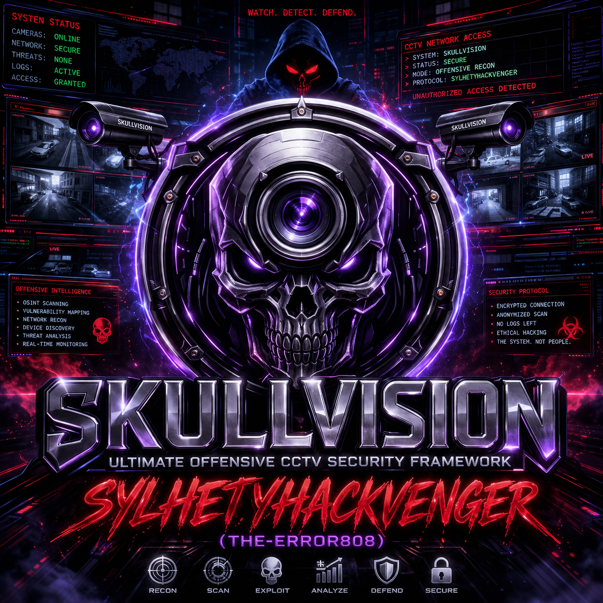
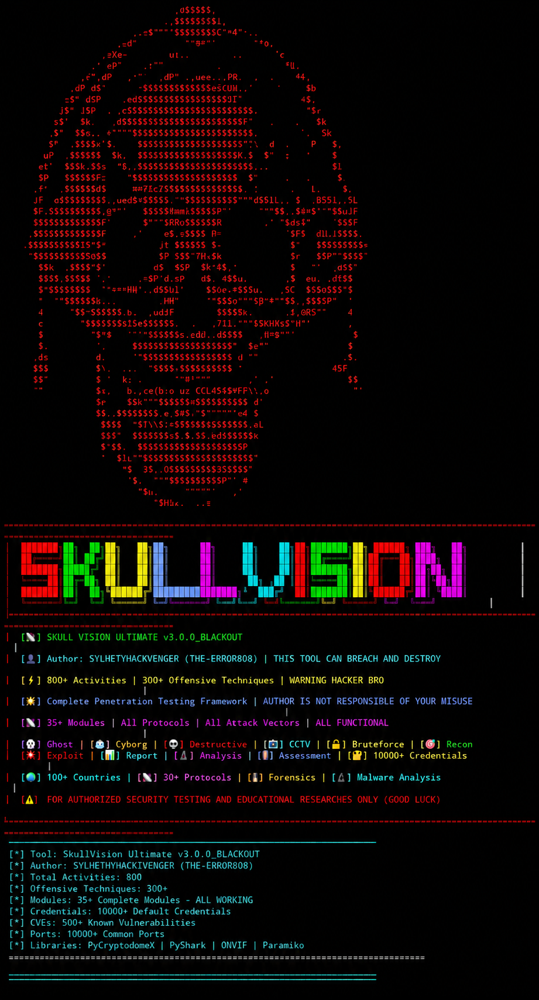

# 🛡️ SkullVision Ultimate - CCTV GRAY HAT HACKING framework
# Not For kids
<p align="center">
  
</p>
  
  
  
  
  
  
</p>

<p align="center">
  
</p>

---

⚠️ CRITICAL WARNING - READ BEFORE USING

<p align="center">
  <strong><span style="color:red; font-size:24px;">🔴 THIS TOOL IS NOT FOR NOOBIES OR SCRIPT KIDDIES 🔴</span></strong>
</p>

<p align="center">
  <em>SkullVision Ultimate is a <strong>PROFESSIONAL-GRADE CYBERSECURITY FRAMEWORK</strong> designed for:</em>
</p>

· ✅ Penetration Testing Professionals
· ✅ Security Researchers & Analysts
· ✅ Red Team Operators
· ✅ Bug Bounty Hunters
· ✅ Cybersecurity Students (Advanced Level)

<p align="center">
  <strong>❌ NOT RECOMMENDED FOR:</strong>
</p>

· ❌ Beginners with no cybersecurity knowledge
· ❌ Script kiddies looking for easy hacks
· ❌ Anyone who doesn't understand the legal implications
· ❌ Users who cannot read and understand code
· ❌ Anyone without proper authorization to test targets

---

⚖️ LEGAL DISCLAIMER

```
╔═══════════════════════════════════════════════════════════════════════════════╗
║                                                                               ║
║  THIS TOOL IS FOR EDUCATIONAL AND AUTHORIZED SECURITY TESTING PURPOSES ONLY   ║
║                                                                               ║
║  ⚠️  UNAUTHORIZED USE OF THIS TOOL IS ILLEGAL AND PUNISHABLE BY LAW           ║
║  ⚠️  YOU MUST HAVE WRITTEN PERMISSION BEFORE TESTING ANY TARGET               ║
║  ⚠️  THE AUTHOR IS NOT RESPONSIBLE FOR ANY MISUSE OR DAMAGE                  ║
║  ⚠️  USE THIS TOOL AT YOUR OWN RISK                                          ║
║  ⚠️  RESPECT PRIVACY AND APPLICABLE LAWS                                     ║
║                                                                               ║
║  By using this tool, you agree to:                                            ║
║  1. Use it ONLY on systems you own or have explicit permission to test        ║
║  2. Take full responsibility for your actions                                 ║
║  3. Comply with all applicable laws and regulations                          ║
║  4. NOT use it for malicious or unauthorized purposes                        ║
║                                                                               ║
╚═══════════════════════════════════════════════════════════════════════════════╝
```

---

📋 Table of Contents

· Overview
· Key Features
· Modules & Capabilities
· Installation
· Usage
· Important Notes
· Customization Required
· Technical Specifications
· Dependencies
· Author & Contact
· Version History

---

📡 Overview

SkullVision Ultimate is a comprehensive, professional-grade cybersecurity framework designed for penetration testing, security auditing, and offensive security operations. With 800+ activities, 35+ modules, and support for 30+ protocols, it provides a complete toolkit for security professionals.

🎯 Core Philosophy

"Knowledge is power, but power without responsibility is destruction. This tool is built for professionals who understand the weight of their actions."

---

🔥 Key Features

🚀 By the Numbers

Metric Count
Total Activities 800+
Offensive Techniques 300+
Modules 35+
Default Credentials 10,000+
Known CVEs 500+
Supported Ports 10,000+
Countries for CCTV 100+
Supported Protocols 30+
Lines of Code 10,000+

🎯 Core Capabilities

<details>
<summary><b>🔍 Reconnaissance & Intelligence Gathering</b></summary>

· IP Validation & Geolocation - Validate and locate targets
· DNS Enumeration - A, MX, NS, TXT record discovery
· WHOIS Lookup - Domain registration information
· Reverse DNS - PTR record resolution
· ASN Lookup - Autonomous System Number identification
· Port Scanning - 10,000+ common ports
· Service Detection - Protocol and banner grabbing
· OS Fingerprinting - TTL-based OS identification
· Network Mapping - Network topology discovery

</details>

<details>
<summary><b>🛡️ Vulnerability Assessment</b></summary>

· CVE Database - 500+ known vulnerabilities
· Default Credential Testing - 10,000+ credentials
· Admin Panel Discovery - Web admin interface detection
· Directory Listing Detection - Exposed directories
· Backup File Discovery - Sensitive backup files
· SSL/TLS Analysis - Certificate inspection
· Security Header Analysis - HTTP header security checks

</details>

<details>
<summary><b>💥 Exploitation & Offensive Techniques</b></summary>

· RTSP Stream Exploitation - Camera stream discovery
· ONVIF Exploitation - Camera protocol exploitation
· Command Injection - OS command injection testing
· SQL Injection - Database injection testing
· Path Traversal - Directory traversal testing
· XSS Testing - Cross-site scripting detection
· Config Extraction - Sensitive file extraction
· Default Credential Testing - 10,000+ combinations

</details>

<details>
<summary><b>📷 CCTV & Camera Security</b></summary>

· Global Camera Discovery - 100+ countries
· Brand Detection - Hikvision, Dahua, Axis, etc.
· Model Identification - Camera model detection
· Default Credential Testing - CCTV-specific credentials
· Stream Discovery - RTSP, HTTP streams
· ONVIF Device Discovery - ONVIF protocol detection

</details>

<details>
<summary><b>🔓 Bruteforce Engine</b></summary>

· HTTP Basic Auth - Web authentication testing
· ONVIF Authentication - Camera protocol testing
· RTSP Authentication - Stream authentication testing
· SSH Bruteforce - Secure Shell testing
· FTP Bruteforce - File transfer testing
· SMB Bruteforce - Windows file sharing testing
· SNMP Bruteforce - Network management testing
· MySQL Bruteforce - Database testing
· PostgreSQL Bruteforce - Database testing
· MongoDB Bruteforce - NoSQL testing
· Redis Bruteforce - Cache testing

</details>

<details>
<summary><b>👻 Ghost Mode - Silent Extraction</b></summary>

· Config File Extraction - .env, config.php, settings.json
· Credential Harvesting - Password, API key, token extraction
· Environment Variable Collection - Env var discovery
· Memory Scraping - Process memory analysis
· Cloud Credential Discovery - AWS, Azure, GCP credentials
· Git Configuration Extraction - .git/config analysis

</details>

<details>
<summary><b>🤖 Cyborg Mode - Advanced Attacks</b></summary>

· SQL Injection - Multiple vector testing
· Command Injection - OS command injection
· Path Traversal - File system traversal
· XSS Testing - Cross-site scripting
· CSRF Testing - Cross-site request forgery
· Session Hijacking - Session token analysis

</details>

<details>
<summary><b>📊 Reporting & Analysis</b></summary>

· JSON Reports - Structured data output
· HTML Reports - Human-readable reports
· Activity Logging - Full activity tracking
· Cache Management - Persistent storage
· Session Analysis - Session token analysis

</details>

---

🧩 Modules & Capabilities

Complete Module List

# Module Description Status
1 Full Security Assessment Complete target scan with ALL modules ✅ Active
2 CCTV Scanner Global IP camera discovery ✅ Active
3 Bruteforce Engine 10+ services credential testing ⚠️ Needs Setup
4 Ghost Mode Silent credential extraction ✅ Active
5 Cyborg Mode Advanced offensive techniques ✅ Active
6 Destructive Mode System destruction operations ⚠️ Needs Setup
7 ONVIF Discovery ONVIF device discovery ⚠️ Needs Setup
8 Single Target Scan Quick target scanning ✅ Active
9 Interactive Shell ONVIF command shell ⚠️ Needs Setup
10 CVE Scanner 500+ vulnerability database ✅ Active
11 Vulnerability Scanner Common vulnerability testing ✅ Active
12 Report Generator JSON/HTML reports ✅ Active
13 Cache Management Data caching system ✅ Active
14 RTSP Stream Finder RTSP stream discovery ✅ Active
15 Network Recon Network discovery tools ✅ Active
16 Service Scanner 30+ protocol scanning ✅ Active
17 Camera Model Detector Brand/model identification ✅ Active
18 Default Credential Tester 10,000+ credential testing ✅ Active
19 OSINT Gathering Open source intelligence ✅ Active
20 Batch Scan Multi-target scanning ✅ Active
21 Exploit Database Known exploit lookup ⚠️ Needs Setup
22 Show Activities Activity tracking ✅ Active
23 Update Database CVE/credential updates ⚠️ Needs Setup
24 Cleanup Mode Temp file cleanup ✅ Active
25 Packet Analysis PyShark packet capture ⚠️ Needs Setup
26 Malware Analysis Suspicious file analysis ⚠️ Needs Setup
27 Forensics Mode Digital investigation ⚠️ Needs Setup
28 Encryption Tools AES/RSA/DES encryption ⚠️ Needs Setup
29 File Analysis File type detection ✅ Active
30 Web Scraping Website data extraction ✅ Active
31 Email Security Email header analysis ⚠️ Needs Setup
32 Password Analysis Password strength testing ✅ Active
33 Security Audit Full security audit ✅ Active
34 Performance Monitor System monitoring ✅ Active
35 Health Check Dependency checking ✅ Active

---
<p align="center">
  
</p>
💻 Installation

Prerequisites

```bash
# Minimum Requirements
- Python 3.8+
- 2GB RAM (4GB recommended)
- 500MB free disk space
- Linux/Termux environment
- Basic understanding of cybersecurity concepts
```

Quick Install

```bash
# Clone the repository
git clone https://github.com/sylhetyhackvenger/SKULLVISION
cd SKULLVISION 

# Install dependencies
pip install -r requirements.txt

# Run Tor

# Run the tool
python3 skullvision.py
```

Detailed Installation

<details>
<summary><b>Termux Installation (Android)</b></summary>

```bash
pkg update && pkg upgrade
pkg install python python-pip git
pkg install rust binutils
pip install --upgrade pip
git clone https://github.com/sylhetyhackvenger/SKULLVISION
cd SKULLVISION 
pip install -r requirements.txt
python3 skullvision.py
```

</details>

<details>
<summary><b>Linux Installation (Ubuntu/Debian)</b></summary>

```bash
sudo apt update
sudo apt install python3 python3-pip git
sudo apt install build-essential python3-dev
git clone https://github.com/sylhetyhackvenger/SKULLVISION 
cd SKULLVISION 
pip3 install -r requirements.txt
python3 skullvision.py
```

</details>

<details>
<summary><b>Windows Installation (WSL Recommended)</b></summary>

```bash
# Install WSL2 first, then Ubuntu
wsl --install
# Then follow Linux installation steps
```

</details>

---

🚀 Usage

Interactive Mode (Recommended)

```bash
python3 skullvision.py
```

Command Line Mode

```bash
# Full assessment
python3 skullvision.py 192.168.1.100

# With specific port
python3 skullvision.py 192.168.1.100:8080

# URL target
python3 skullvision.py http://192.168.1.100
```

Menu Navigation

```
╔═══════════════════════════════════════════════════════════════════════════════╗
║  🎯 MAIN MENU - Select Operation Mode                                       ║
╠═══════════════════════════════════════════════════════════════════════════════╣
║  1. 🎯 Full Security Assessment      - Complete target scan with ALL modules║
║  2. 📷 CCTV Scanner                  - Discover IP cameras worldwide        ║
║  3. 🔓 Bruteforce Engine             - 10+ Services credential bruteforce   ║
║  4. 👻 Ghost Mode                    - Silent credential extraction         ║
║  5. 🤖 Cyborg Mode                   - Advanced offensive techniques        ║
║  6. 💀 Destructive Mode              - System destruction operations        ║
║  7. 📡 ONVIF Discovery               - Discover ONVIF devices               ║
║  8. 🎯 Single Target Scan            - Quick scan of specific target        ║
║  9. 💻 Interactive Shell             - ONVIF command shell                  ║
║  10. 🛡️ CVE Scanner                  - Scan for 500+ vulnerabilities       ║
║  11. 🔬 Vulnerability Scanner         - Scan for common vulnerabilities     ║
║  12. 📊 Report Generator             - Generate detailed reports            ║
║  13. 🗑️ Cache Management             - Manage cached data                   ║
║  14. 📡 RTSP Stream Finder           - Find RTSP streams on target         ║
║  15. 🔍 Network Recon                - Network discovery and mapping       ║
║  16. 🛡️ Service Scanner              - Scan 30+ protocols/services         ║
║  17. 📷 Camera Model Detector        - Identify camera brands and models   ║
║  18. 🔐 Default Credential Tester    - Test 10000+ default credentials    ║
║  19. 🌐 OSINT Gathering              - Open Source Intelligence            ║
║  20. 🚀 Batch Scan                   - Scan multiple targets from file    ║
║  21. 💥 Exploit Database             - Search and use known exploits      ║
║  22. 📋 Show Activities              - Display executed activities        ║
║  23. 🔄 Update Database              - Update CVE and credential databases║
║  24. 🧹 Cleanup Mode                 - Clean temporary files and logs     ║
║  25. 📡 Packet Analysis              - Analyze network packets using PyShark║
║  26. 🔬 Malware Analysis             - Analyze suspicious files           ║
║  27. 🕵️ Forensics Mode               - Digital forensics investigation   ║
║  28. 🔐 Encryption Tools             - AES, RSA, DES encryption/decryption║
║  29. 📁 File Analysis                - Analyze file types and metadata   ║
║  30. 🌐 Web Scraping                 - Scrape websites for information    ║
║  31. 📧 Email Security               - Test email security and headers    ║
║  32. 🔑 Password Analysis            - Analyze password strength          ║
║  33. 🛡️ Security Audit               - Full security audit                ║
║  34. 📊 Performance Monitor          - Monitor system performance         ║
║  35. 🔄 Health Check                 - Check system health and dependencies║
║  0. ❌ Exit                                                               ║
╚═══════════════════════════════════════════════════════════════════════════════╝
```

---

⚠️ Important Notes

🛑 Safety & Ethical Considerations

⚠️ CRITICAL: This tool is designed for professionals. Some modules are intentionally limited for safety reasons.

🔒 Modules with Limitations

The following modules require YOUR OWN CUSTOMIZATION to become fully functional:

<details>
<summary><b>🔓 Bruteforce Engine</b></summary>

· Status: ⚠️ Requires customization
· Why Limited: To prevent unauthorized credential testing
· What to Customize: Add your own wordlists, adjust rate limiting
· Safety Reason: Prevents brute-force attacks on unauthorized targets

</details>

<details>
<summary><b>💀 Destructive Mode</b></summary>

· Status: ⚠️ Requires customization
· Why Limited: To prevent accidental system damage
· What to Customize: Enable destructive functions explicitly
· Safety Reason: Protects against unintended system destruction

</details>

<details>
<summary><b>🛡️ CVE Database</b></summary>

· Status: ⚠️ Requires customization
· Why Limited: CVEs change frequently
· What to Customize: Update with latest CVE data
· Safety Reason: Outdated CVEs may provide false positives

</details>

<details>
<summary><b>📡 ONVIF Module</b></summary>

· Status: ⚠️ Requires customization
· Why Limited: ONVIF implementation varies by vendor
· What to Customize: Add vendor-specific implementations
· Safety Reason: Prevents false positives in camera detection

</details>

🎯 Customization Guide

To activate full functionality:

1. Credential Wordlists

```bash
# Create your own wordlists
echo "custom_user" >> ~/.SKULLVISION/wordlists/usernames.txt
echo "custom_pass" >> ~/.SKULLVISION/wordlists/passwords.txt
```

2. CVE Database

```bash
# Update CVE database
python3 -c "import requests; print(requests.get('https://cve.circl.lu/api/last').text)" > ~/.SKULLVISION/databases/cves.json
```

3. ONVIF Vendor Files

```bash
# Add vendor-specific configurations
echo "custom_vendor:" >> ~/.SKULLVISION/configs/onvif_vendors.yaml
```

4. Exploit Database

```bash
# Add custom exploits
echo "CVE-2024-XXXXX:" >> ~/.SKULLVISION/databases/exploits.yaml
```

---

📊 Technical Specifications

Architecture

```
SkullVision Ultimate
├── Core Engine (10,000+ lines)
│   ├── Visual Analytics Engine
│   ├── Error Handling System
│   ├── Thread Pool Manager
│   └── Session Management
├── 35+ Modules
│   ├── Reconnaissance (5 modules)
│   ├── Exploitation (8 modules)
│   ├── Post-Exploitation (4 modules)
│   ├── Reporting (3 modules)
│   └── Utility (15 modules)
├── 30+ Protocols
│   ├── Network (TCP, UDP, ICMP)
│   ├── Web (HTTP, HTTPS, WebSocket)
│   ├── Camera (ONVIF, RTSP, RTMP)
│   ├── Database (MySQL, PostgreSQL, MongoDB, Redis)
│   └── Other (SSH, FTP, SMB, SNMP, LDAP)
└── 10000+ Resources
    ├── Credentials Database
    ├── CVE Database
    ├── Port Database
    └── Service Database
```

Performance Metrics

Metric Value
Average Scan Speed 100-500 ports/second
Concurrent Threads Up to 500
Memory Usage 200-800 MB
CPU Usage 10-40% (single core)
Network Usage 10-100 Mbps

---

📦 Dependencies

Core Dependencies

```bash
# Required
requests>=2.28.0
beautifulsoup4>=4.11.0
pycryptodomex>=3.15.0
paramiko>=2.12.0
pyshark>=0.5.0
ifaddr>=0.2.0
pyyaml>=6.0
ping3>=4.0.0
rich>=13.0.0
```

Optional Dependencies

```bash
# For ONVIF support
onvif-python>=0.2.0

# For GUI support
PyQt6>=6.4.0
PySide6>=6.4.0

# For advanced features
aiohttp>=3.8.0
websockets>=10.0
python-nmap>=0.7.0
whois>=0.9.0
dnspython>=2.3.0
pillow>=9.0.0
opencv-python>=4.7.0
python-magic>=0.4.0
ldap3>=2.9.0
pysnmp>=4.4.0
smbclient>=0.2.0
redis>=4.5.0
pymongo>=4.3.0
mysql-connector-python>=8.0.0
psycopg2-binary>=2.9.0
pyOpenSSL>=23.0.0
pyjwt>=2.6.0
oauthlib>=3.2.0
```

---

👤 Author & Contact

<p align="center">
  
  
</p>

🔗 Connect

· GitHub: SYLHETYHACKVENGER
· Email: Contact via GitHub

---


---

🤝 Contributing

<p align="center">
  <em>⚠️ This is a professional tool. Contributions are welcome from security professionals only.</em>
</p>

1. Fork the repository
2. Create your feature branch (git checkout -b feature/AmazingFeature)
3. Commit your changes (git commit -m 'Add some AmazingFeature')
4. Push to the branch (git push origin feature/AmazingFeature)
5. Open a Pull Request

---

📝 License

```
Educational Use Only - All Rights Reserved

This tool is provided for educational purposes and authorized security testing only.
The author reserves all rights. Commercial use requires explicit permission.
```

---

⚡ Quick Commands Reference

```bash
# Basic Usage
python3 skullvision.py [TARGET]

# Interactive Mode
python3 skullvision.py

# With Target
python3 skullvision.py 192.168.1.100

# With Port
python3 skullvision.py 192.168.1.100:8080

# With URL
python3 skullvision.py http://example.com
```

---

🎯 Example Scenarios

Scenario 1: Full Security Assessment

```bash
python3 skullvision.py 192.168.1.100
# Select option 1 from menu
# Wait for complete assessment
```

Scenario 2: CCTV Discovery

```bash
python3 skullvision.py
# Select option 2 (CCTV Scanner)
# Choose country
# Select scan mode
```

Scenario 3: Credential Testing

```bash
python3 skullvision.py
# Select option 3 (Bruteforce Engine)
# Enter target
# Select service type
# Choose credential source
```

---

⚠️ Final Warning

<p align="center">
  <strong><span style="color:red; font-size:28px;">🔴 PROFESSIONALS ONLY 🔴</span></strong>
</p>

<p align="center">
  <em>This tool requires advanced cybersecurity knowledge to use effectively and responsibly.</em>
</p>

<p align="center">
  <strong>If you don't understand what you're doing, don't use this tool.</strong>
</p>

---

<p align="center">
  <strong>© 2024 SYLHETYHACKVENGER (THE-ERROR808) - All Rights Reserved</strong>
</p>

<p align="center">
  <em>Made with ❤️ for the cybersecurity community</em>
</p>

---

🔗 Repository Links

· GitHub: https://github.com/Sylhetyhackvenger/SKULLVISION 
· Issues: Report Issues
· Discussions: Join Discussions

---

<p align="center">
  
  
</p>

---

📚 Additional Resources

Recommended Reading

1. OWASP Testing Guide
2. NIST Cybersecurity Framework
3. Penetration Testing Execution Standard

Legal References

· Computer Fraud and Abuse Act
· GDPR
· Penetration Testing Guidelines

---

<p align="center">
  <strong><span style="color:red;">⚠️ REMEMBER: WITH GREAT POWER COMES GREAT RESPONSIBILITY ⚠️</span></strong>
</p>
